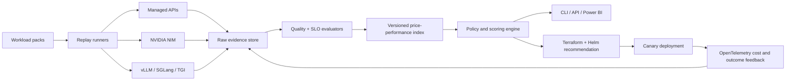

# AI Inference Price–Performance Index

[](https://github.com/AAH20/ai-inference-price-performance-index/actions/workflows/ci.yml)

An open, reproducible index for comparing **LLM inference**, **GPU cloud cost**, **NVIDIA NIM**, **vLLM**, **Azure AI Foundry**, **Kubernetes GPU infrastructure**, and managed AI APIs by the metric that matters: **cost per successful business outcome**.

This repository is a working foundation for AI FinOps—not a vendor price table. It combines performance, quality, reliability and total operating cost, records provenance for every candidate, and rejects options that fail workload SLOs.

## Why another benchmark?

Tokens per second and cost per token are incomplete. Production agentic systems pay for retries, long context, idle GPU capacity, platform engineering, telemetry, networking and failed outcomes. A cheap response that cannot complete the workflow is expensive.

The index answers:

- Which model/provider/runtime satisfies the quality, latency and availability floor?
- What is its effective cost per successful request?
- When does managed inference beat self-hosted GPU capacity?
- Which assumptions need a real workload replay before procurement?

## Working MVP

- Deterministic scoring and eligibility engine
- Provider-neutral benchmark schema
- CLI that ranks candidates and exports JSON
- SHA-256 provenance fingerprint for each evaluated record
- Quality, latency, availability and region policy gates
- Illustrative Azure AI Foundry, vLLM and NVIDIA NIM scenarios
- Unit tests and GitHub build validation
- Docker packaging
- Terraform and Helm delivery foundations

> **Evidence boundary:** bundled figures are explicitly illustrative. They are not vendor quotes or claimed benchmarks. Replace them with signed workload-replay evidence before making procurement decisions.

## Quick start

```bash
python -m venv .venv
source .venv/bin/activate
pip install -e .
inference-index compare \
  --workload examples/workload.json \
  --dataset datasets/illustrative-index.json \
  --output result.json
```

Run tests:

```bash
pip install pytest
pytest -q
```

Or use Python's built-in runner without installing test dependencies:

```bash
PYTHONPATH=src python -m unittest discover -s tests -v
```

Run without installing:

```bash
PYTHONPATH=src python -m inference_index.cli \
  --workload examples/workload.json \
  --dataset datasets/illustrative-index.json
```

## Scoring contract

Each candidate is first evaluated against hard constraints:

- Minimum quality
- Maximum P95 latency
- Minimum availability
- Required region

Eligible candidates are ranked using quality, successful-request rate and effective cost per successful request. The complete calculation remains visible in the output; the engine does not hide a model choice behind an LLM-generated explanation.

## Reference architecture



See [docs/architecture.md](docs/architecture.md) for the target production design and trust boundaries.

## Roadmap

1. OpenTelemetry workload-replay collector and canonical event schema
2. Signed community benchmark submissions with hardware/runtime metadata
3. Live provider-price ingestion with timestamped snapshots
4. Prometheus/DCGM GPU utilization collection
5. Agentic tool-use, RAG, code and IaC workload packs
6. Parquet dataset and DuckDB analytics
7. REST API, Grafana dashboard and Power BI executive template
8. Architecture compiler for Terraform/OpenTofu and Helm
9. Canary validation against realized cost and reliability

## Commercial use cases

- GPU and managed-API procurement assessments
- AI infrastructure modernization
- Kubernetes GPU utilization optimization
- Model and provider migration planning
- AI FinOps managed services
- Sovereign/private AI architecture validation
- Executive cost, risk and capacity forecasting

For enterprise Azure, multi-cloud, AI infrastructure, networking, security and FinOps architecture, visit [A2Z SOC](https://a2zsoc.com/).

## License

Apache-2.0. Contributions must preserve evidence provenance and may not represent illustrative data as measured production results.
